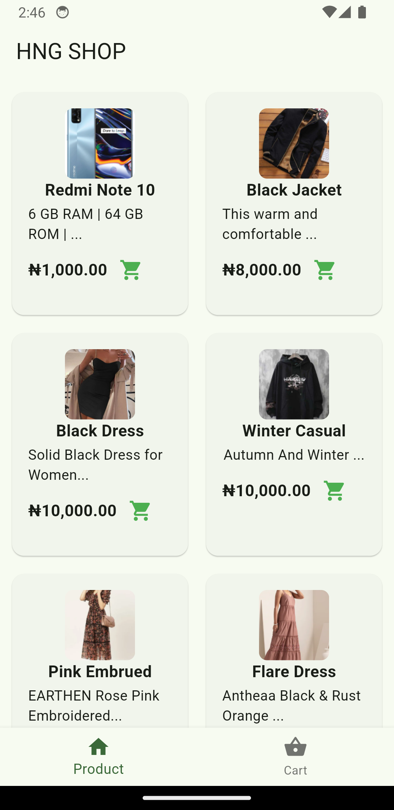
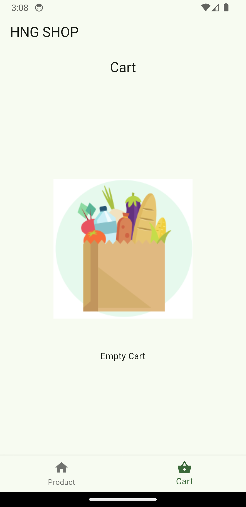
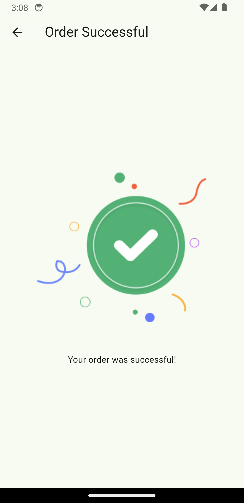
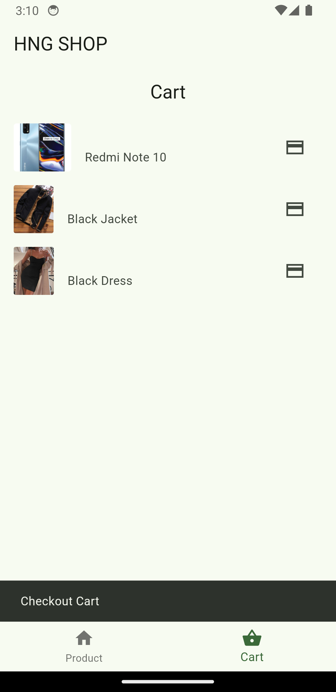

# HNG SHOP APP

This is an assignment report for the HNG stage two task. I was tasked to develop a simple shopping app with a third-party API and packages with two menus: product and cart.

# Features

- List of Product(API)
- Add and remove products from the cart list.
- Navigate to the order successful screen from the cart screen.
- Packages used are; HTTP, Intl

  # Links
  
- The API Docs [Read](https://docs.timbu.cloud/api/intro)

- The API [Link](http://timbu.cloud/)
  
# Appetize Demo

- you can view the app on Appetize.io [Click here](https://appetize.io/embed/b_3cw6d6ipirp73ycftfga7qg7du) 

# Screenshots
<b>Product Screen</b>

<b>Empty Cart Screen</b>

<b>Successful Order Screen</b>

<b>Cart Screen</b>

